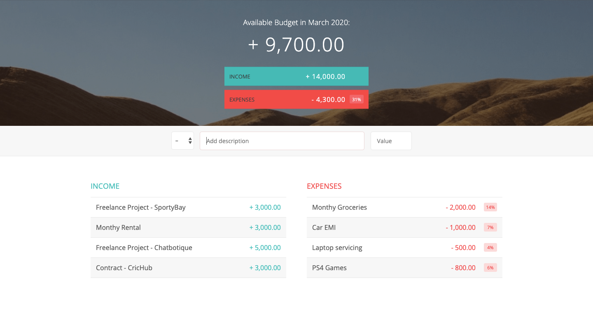

# Budjety

[Budgety](https://budgetyofficial.netlify.com/) is a budget app build using pure Javascript that lets you add your income and expenses. It keeps track of your monthly budget, incomes and expenses.


## Table of content

- [Description](#Description)
- [Installation](#installation)
- [Contact](#contact)

## Description

The app lets you add your daily incomes and expenses. It also shows you the available budget for the month as well as the percentage of individual as well as total expenses in respect to the total income.

## Installation

1. Clone the project to your local directory

```
git clone https://github.com/KaushikShivam/budgety
```

2. The project uses NPM for managing dependencies. Run npm install to install all the required dependencies

```
npm install
```

3. Run the task runner to run the app

```
npm run start
```

## Contact

You can contact me at:

- [Portfolio](https://www.shivamkaushik.com)
- [Email](mailto:shivamkaushikofficial@gmail.com)
- [Linkedin](https://www.linkedin.com/in/kshivamdev/)
- [Twitter](https://twitter.com/kShivamDev)
- [Medium](https://medium.com/@shivamkaushikofficial)
- [Angellist](https://angel.co/kshivamdev)
